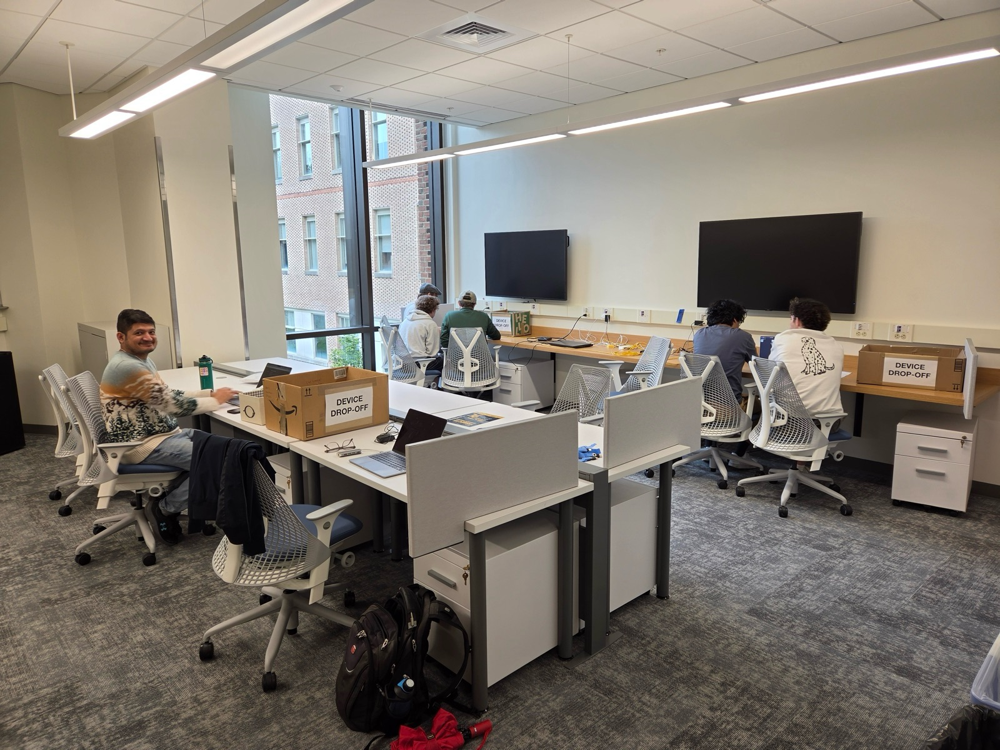

+++
title = "TribeCTF 2026 Stats"
description = ""
draft = false
+++

## $ Quick Stats

TribeCTF 2026 ran for 24.5 hours, October 3-4, 2026, in ISC 4 (CDSP Building) at William & Mary.

- **68** students played on **25** teams
- **8** different schools represented
- **30** challenges worth **19,750** total points
- **324** flags captured, and **3,484** wrong flags submitted along the way
- **5** challenges stayed unsolved till the end
- **14,250** points scored by Team **MasonCC** from George Mason University - 1st Place
- **13,250** points scored by Team **WhatIsAstig** from Old Dominion University - 2nd Place
- **12,950** points scored by Team **CNS@UVA** from University of Virginia - 3rd Place

## $ Final Standings


images/2026-1st-place.jpg | TribeCTF 2026 1st Place Winners, Team MasonCC from George Mason University
images/2026-2nd-place.jpg | TribeCTF 2026 2nd Place Winners, Team WhatIsAstig from Old Dominion University
images/2026-3rd-place.jpg | TribeCTF 2026 3rd Place Winners, Team CNS@UVA from University of Virginia
images/2026-honorable-mentions.jpg | TribeCTF 2026 Honorable Mentions (over 8,000 pts), places 4 through 9


| Position | Team Name         | School                         | Points | Solves |
|----------|-------------------|--------------------------------|--------|--------|
|     1    | MasonCC           | George Mason University        | 14250  | 25     |
|     2    | WhatIsAstig       | Old Dominion University        | 13250  | 23     |
|     3    | CNS@UVA           | University of Virginia         | 12950  | 23     |
|     4    | W VP@CNU          | Christopher Newport University | 12750  | 23     |
|     5    | pwn@vt            | Virginia Tech                  | 10750  | 21     |
|     6    | Pro(tein) Protein | William & Mary                 | 10450  | 20     |
|     7    | Wu-Tang LAN       | William & Mary                 | 9450   | 19     |
|     8    | Griffins          | William & Mary                 | 8950   | 18     |
|     9    | BigOnes@VT        | Virginia Tech                  | 8450   | 18     |
|    10    | Team AWESOME      | William & Mary                 | 7950   | 17     |

Prizes went to the top three: **$2,500** to MasonCC, **$1,000** to WhatIsAstig, and **$500** to CNS@UVA.

## $ Schools Represented

| School                           | Students |
|----------------------------------|----------|
| William & Mary                   | 28       |
| Virginia Tech                    | 12       |
| Christopher Newport University   | 10       |
| Virginia Commonwealth University | 7        |
| George Mason University          | 4        |
| University of Virginia           | 4        |
| Old Dominion University          | 2        |
| Norfolk State University         | 1        |

## $ Solves by Difficulty

| Difficulty | Points  | Challenges | Solves |
|------------|---------|------------|--------|
| Intro      | 50      | 1          | 25     |
| Easy       | 300     | 9          | 150    |
| Medium     | 500     | 9          | 92     |
| Hard       | 1000-1500 | 10       | 57     |
| Insane     | 2000    | 1          | 0      |

## $ Challenge Highlights

- **Most solved:** catacombs (Cryptography, 300 pts), solved by 23 of 25 teams. Every team captured The-First-Flag.
- **Toughest solved:** Project Keystone: Aftermath (misc, 1500 pts), the highest-value challenge anyone solved, cracked by 4 teams. MasonCC drew first blood.
- **Rarest solves:** Griffins Game (Hardware, 1000 pts) and Piscator (CAGE, 500 pts) each fell to just 2 teams.
- **Unsolved:** Griffin Droppings and Griffin Tongues (RE, 1000 pts each), plus CAGE challenges Griffin-Corps-Career, RouterHard, and RouterInsane. RouterInsane (2000 pts), the event's only Insane challenge, held out all weekend.
- **First bloods:** MasonCC took first blood on 10 challenges, followed by pwn@vt with 6 and Pro(tein) Protein with 3.

## $ The CAGE

2026 was the debut of the [CAGE](/cage/), a sealed, monitored room with no personal devices and no AI.

- **18** of 25 teams entered the CAGE, over **82** sessions (40 booked, 42 walk-in) on **4** stations
- **70** hours of CAGE time, **51** minutes per session on average; **44** of those hours were free time and walk-ins beyond the 2-hour guarantee
- **10** teams booked their full 2 hours; MasonCC logged the most CAGE time (**10.2** hours over 11 sessions)
- **7.5** minutes median wait from request to invite; **4** invites went unanswered
- **14** sessions started between midnight and 6 AM
- **8** CAGE-only challenges worth **5,400** points: **42** solves by **17** teams
- **3** CAGE challenges (Griffin-Corps-Career, RouterHard, RouterInsane) went unsolved

The CAGE barely slept. From the first session at 10:38 AM Saturday to the last one ending at 10:36 AM Sunday, it never sat empty for more than 26 minutes.

MasonCC drew the first CAGE blood at 10:46 AM Saturday, about eight minutes into its first CAGE session, the first of the event.

All four stations were full for a combined 10.3 hours, and at the busiest moment, 9:41 PM Saturday, five teams were waiting in the queue. The longest single sitting went to team **laptop**: 3 h 33 min, from 12:23 to 3:56 AM Sunday.

Teams took their CAGE backup drives home as memorabilia.

 

*A full TribeCTF 2026 recap with photos and writeups is coming soon.*
