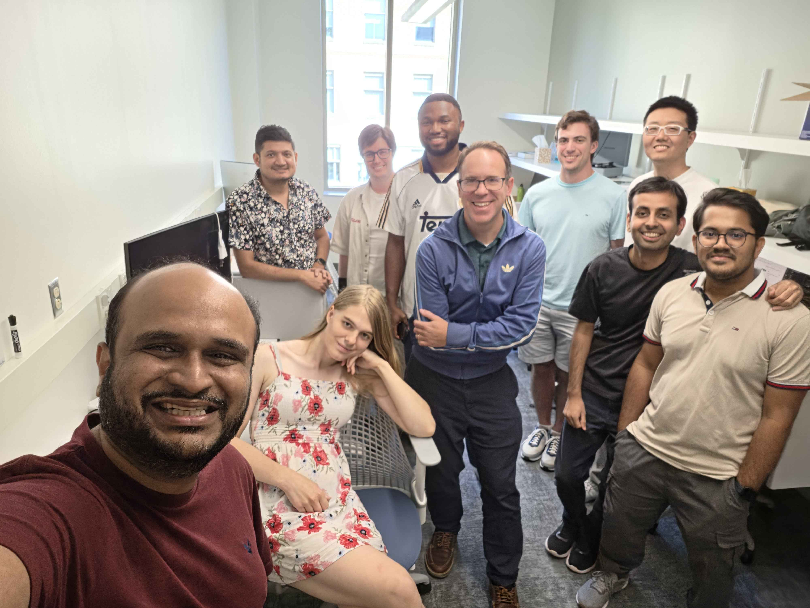

+++
title = "About"
description = ""
+++

## $ What is TribeCTF?
\> TribeCTF is William & Mary's annual Capture The Flag cybersecurity competition. It's designed to challenge, inspire, and educate participants in various aspects of information security.

## $ Our Mission
\> Our goal is to foster cybersecurity skills, promote ethical hacking, and build a community of security enthusiasts at William & Mary and beyond.

## $ Prizes
\> **TribeCTF 2026 Prize Pool 💰💰 (awarded!):** 
- Winner took home **$2,500**
- Runner-up got **$1,000**
- Third place received **$500!!**

## $ When and Where?
\> **TribeCTF 2026** took place **October 3-4** as an **in-person event** at William & Mary in **ISC 4 (CDSP Building)**, and it was a success! The competition ran ~24 hours, from Saturday 10:00 AM to Sunday 10:30 AM. Thanks to everyone who came out and hacked with us. We're already looking forward to **TribeCTF 2027**!

Check the [schedule page](/schedule) for how the weekend went down.

## $ Who Can Participate?
\> TribeCTF is open to currently enrolled college students (Undergraduate and Graduate levels) who are **18 or older**, from curious beginners to experienced hackers. No prior experience is required – just bring your curiosity and willingness to learn! You'll need to register with a valid `.edu` email address and bring a student ID to the event. You can participate individually or form teams of up to 4 students!

## $ How Do I Register?
\> Registration for TribeCTF 2026 is closed. Dates and registration for **TribeCTF 2027** haven't been announced yet, so stay tuned!

## $ The Organizing Committee
\> TribeCTF is brought to you by a dedicated team of cybersecurity enthusiasts from the CyberSecurity Center @ William & Mary, Tribe Cyber and collaborators from the Industry. Our organizing committee includes students, faculty, and industry professionals committed to creating an exciting and educational event.

\> **Left to right:** Adwait Nadkarni, Lily Gloudemans, Pankaj Niroula, Asher Montague, Victor Olaiya, Stephen Herwig, Nicholas Janis, Chengao Du, Aashutosh Poudel, and Md Akram Khan. Not pictured: Yue Xiao.



## $ Sponsor TribeCTF 2027
\> **We're looking for sponsors to level up TribeCTF 2027!** Sponsorship puts your
organization in front of hundreds of driven students from across the region — the
next generation of security engineers, analysts, and researchers — while directly
funding prizes, food, and infrastructure for the event.

| Tier | Amount | What you get |
|---|---|---|
| `root` | **$3,000+** | Naming rights on a challenge track, logo on site + merch + venue banner, speaking slot at the opening ceremony, on-site recruiting table, resume book |
| `sudo` | **$2,000** | Logo on site + merch, on-site recruiting table, resume book |
| `daemon` | **$1,000** | Logo on site + merch |

\> Want to sponsor, or have something else in mind? Get in touch with the
[WM CyberSecurity Center](https://cybersecurity.wm.edu/) — we're happy to put
together a package that fits.
