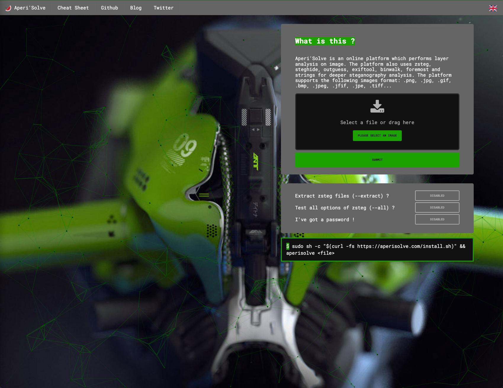
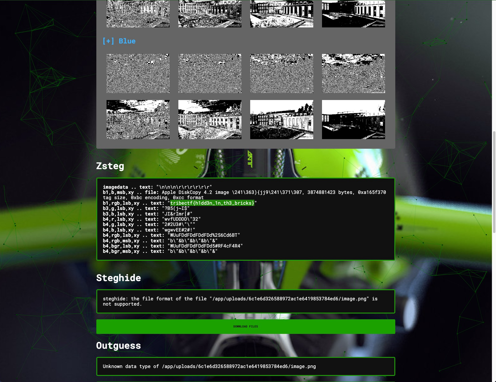

+++
title = "Crown Jewel"
description = ""
layout = "writeup"
category = "Forensics"
points = "300pts"
time_spent = "15 mins"
tools_used = "Python, Aperi' Solve"
date = "2024-11-02"
+++


This challenge named `Crown Jewel` was one of the easier challenges in the Forensics category.
For this challenge, you were given a single file `ISC4.png`. 

Upon first glance, this file would look completely normal, however, for those experienced with image forensics or a
quick google search would likely tell you this is some kind of steganography challenge. 

Doing a quick google search of `steg online` you can come across the following website 
[https://www.aperisolve.com/](https://www.aperisolve.com/). Aperi' Solve is an online tool set for basic steganography
challenges. 



Uploading the image to site shows a very quick way to solve this challenge:



However, another way to solve this challenge would be to use Python, to write script that can undo the hiding method
used here, LSB Steg. LSB Steg or Least Significant Bit Steganography, is a steg method where you take each pixel and 
grab the LSB value from each of its pixel channels. For a nice animated tutorial checkout the following site 
[CTF 101](https://ctf101.org/forensics/what-is-stegonagraphy/).

From this tutorial, we can see that LSB often presents itself when the file size is slightly larger than normal and the
image otherwise looks entirely normal. It is worth noting that this is a trait of steg that often makes it extremely 
difficult in the real world to identify steg unless you can extract usable data. However, for the purpose of CTFs it is
often safe to assume that if you have an image it might be steg'd. With that said, on to the Python script that would 
get you the flag using a Python LSB library. 

```python
from PIL import Image
import os


def int2bin(n):
    return "{0:08b}".format(n)


def readLSB(h, w, px):
    binaryLSB = ""
    for y in range(h):
        for x in range(w):
            for i in px[x, y]:
                binaryLSB += int2bin(i)[-1:]

    output = ""
    for i in range(int(len(binaryLSB) / 8)):
        output += chr(int(binaryLSB[i * 8:i * 8 + 8], 2))

    return output


def saveOutput(filename, content):
    f = open(filename, "w")
    f.write(content)
    f.close()


def main():
    text = ""
    binText = ""
    filename = ""
    output = ""
    imageFile = '../Files/ISC4.png'
    image = Image.open(imageFile)
    px = image.load()
    w, h = image.size

    filename, extension = os.path.splitext(imageFile)

    output = readLSB(h, w, px)
    newFileName = f"{filename}.txt"
    saveOutput(newFileName, output)
    print(f"File saved: {newFileName}")


if __name__ == "__main__":
    main()
```

You can retrieve the flag.

`tribectf{h1dd3n_1n_th3_bricks}`