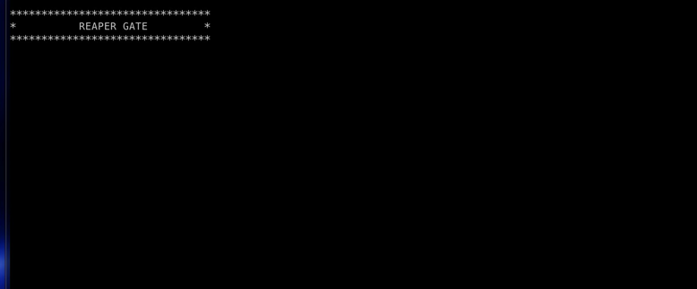
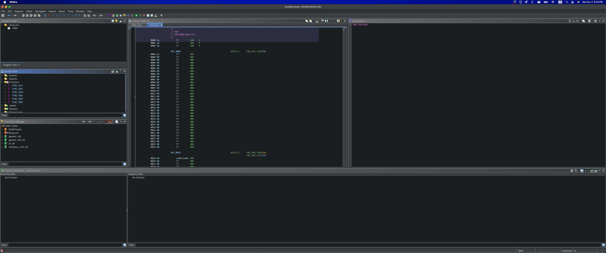
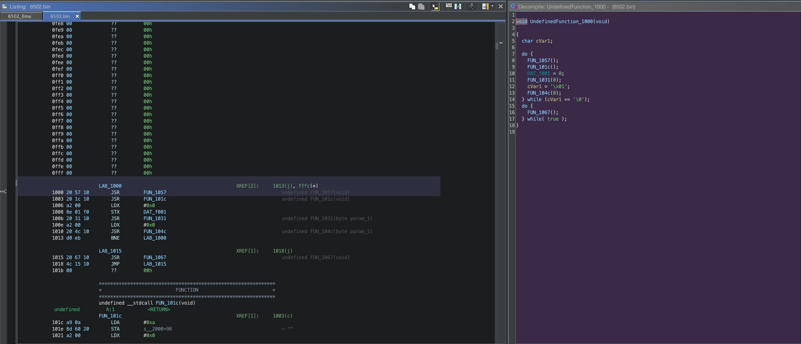
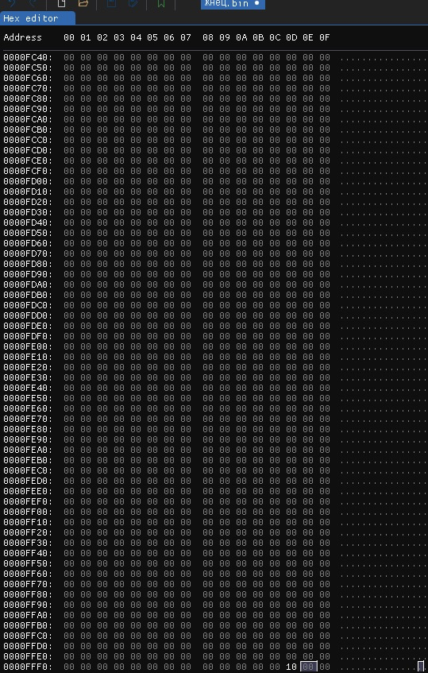
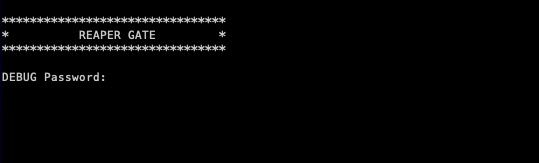
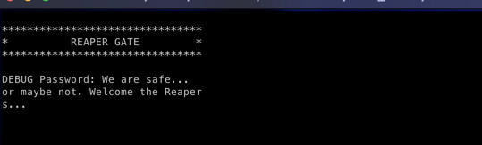

+++
title = "Old School"
description = ""
layout = "writeup"
category = "Reverse Engineering"
points = "1000 pts"
time_spent = "X mins"
tools_used = "Ghidra, ImHex"
date = "2024-11-03"
+++

This challenge named `Old School` is a nod back to the old days NES.
In this challenge you are given 2 files `альфа` and `Жнец.bin`.

Jumping straight into the challenge the first thing we can do is use the `file`
command to try and see what kind of files we are dealing with.

```shell
❯ file альфа
альфа: ELF 64-bit LSB pie executable, x86-64, version 1 (SYSV), dynamically linked, 
interpreter /lib64/ld-linux-x86-64.so.2, BuildID[sha1]=2970d4e8f12c7fffc8af9ef296dd4f2877d82226, 
for GNU/Linux 3.2.0, not stripped

❯ file Жнец.bin
Жнец.bin: data
```

From this, we can see one file is an ELF 64-bit executable and the other is an
unknown file type.

Running the executable file we get the following error:

```shell
❯ ./альфа

FILENAME: (null)
ERROR: Couldn't open (null)
```

Passing the program a random file as its first argument we get the following error:
```shell
❯ ./альфа text.txt

FILENAME: test.txt
ERROR: Couldn't open test.txt
```

This error gives us two important pieces of insight: one, we have an executable
that we have to interact with that's an ELF 64-bit executable and it takes 1 required
argument that is an input file. The second is that, the file we are given is the required
argument to our executable. From this we can tell that we need to use the program
to work with the binary to get the flag. 

Testing this theory we get:

and then killing the program with ctrl-c we get:
```shell
❯ ./альфа Жнец.bin
A:0 X:1 Y:2 SP:00fb PC:734e Cycle:26454
Flags: C:1, Z:1, I:0, D:0, B:0, -:0, V:0, N:0
BRK Hit - Shutting Down...
```

From this output, we can see that we are dealing with some kind of emulator, 
likely for an `Old School` machine. In this case `альфа` is our emulator and `Жнец.bin`
is our program. A quick google search for architectures that use the A, X, and Y
registers, and we can see that we have a 6502 emulator in front of us. 

So from this point, we have a couple of different options. The first would be to try and reverse engineer the emulator
a bit to understand what the code is doing. The second would be just to load the binary into a 6502 disassembler and 
begin reverse engineering it. For the purposes of learning and clarity I will do both. So it's time to load up both into
your favorite disassembler of choice and start reverse engineering. For me, I am going to use Ghidra since it's free, open
source and supports 6502.

After loading them into Ghidra, we can see in the binary that there are a lot of null bytes, also that Ghidra does not 
ID any kind of main function or entry point. We can also see that the binary is getting treated as a flat binary, but 
more on this later. 



So, in order to find the start of the program we can look for the reset vector on the 6502.
For those who don't know, the reset vector is one of the many system interrupts found in hardware in the interrupt vector
table (ISR) that define what happens when different hardware level interrupts are called. You can think of them as 
system calls for the hardware. In particular, the reset vector is the interrupt that gets called when a system reboots. 
It loads the all necessary code for the device to being work. For embedded systems like our 6502 emulator, this means 
the entry point of our code.

In order to find the reset vector, there are 2 ways that we could do it. The first and more simple way, would be to 
google for it. The second would be to reverse engineer the emulator a bit in order to see what value it reads to load
the code. If we go the quick google route, we can see that the reset vector is found at address, `$FFFC-$FFFD` and is a
16 bit little endian value. Thankfully, Ghidra appears to have gotten this value during its analysis. Going to this value,
and jumping to its routine, we can find the entry point at address `$7331`.

```
                 **************************************************************
                 *                          FUNCTION                          *
                 **************************************************************
                 undefined __stdcall FUN_7331(void)
 undefined         A:1            <RETURN>
                 FUN_7331                                        XREF[2]:     7354(j), fffc(*)  
7331 a5 ca           LDA        DAT_00ca                                         = 29h
7333 6a              ROR        A
7334 45 00           EOR        DAT_0000
7336 48              PHA
7337 a5 fe           LDA        DAT_00fe                                         = 1Ch
7339 a2 01           LDX        #0x1
733b 2a              ROL        A
733c 2a              ROL        A
733d 2a              ROL        A
733e 55 00           EOR        0x0,X
7340 48              PHA
7341 a5 10           LDA        DAT_0010                                         = 01h
7343 a0 02           LDY        #0x2
7345 6a              ROR        A
7346 6a              ROR        A
7347 59 00 00        EOR        0x0,Y
734a 48              PHA
734b 68              PLA
734c a9 00           LDA        #0x0
734e 68              PLA
734f a9 00           LDA        #0x0
7351 68              PLA
7352 a9 00           LDA        #0x0
7354 4c 31 73        JMP        FUN_7331

```

Going to the entry point, we get the following subroutine. Referencing this 
[site](https://www.pagetable.com/c64ref/6502/?tab=2) we can get an idea of the different instructions in the 6502. 
So, reading the code we can see the following:

```asm
entry:
    LDA $CA     ; Load 0x29 from 0x00CA into A
    ROR A       ; Rotate right A 
    EOR $00     ; XOR A with value @ 0x0000 (0x4A)
    PHA

    LDA $FE     ; Load 0x1C from 0x00FE into A
    LDX #$01    ; Load 0x01 into X
    ROL A       ; Rotate left A 
    ROL A       ; Rotate left A 
    ROL A       ; Rotate left A 
    EOR $00,X   ; XOR A with value @ 0x0001 (0x4D)
    PHA         ; Push A onto the stack

    LDA $10     ; Load 0x01 from 0x0010 into A
    LDY #$02    ; Load 0x02 into X
    ROR A       ; Rotate right A 
    ROR A       ; Rotate right A 
    EOR $00,Y   ; XOR A with value @ 0x0002 (0x50)
    PHA         ; Push A onto the stack

    PLA
    LDA #$00    ; Clear A
    PLA
    LDA #$00    ; Clear A
    PLA
    LDA #$00    ; Clear A
    JMP entry
```

Roughly translated to python we get the follwing:

```python
def main():
    reg_a = 0x29
    reg_a >>= 1
    reg_a ^= 0x4a
    # push to stack

    reg_a = 0x1c
    reg_x = 0x01 
    reg_a <<= 1
    reg_a <<= 1
    reg_a <<= 1
    reg_a ^= 0x4d # mem[0x00 + reg_x]
    # push to stack 

    reg_a = 0x01
    reg_y = 0x02
    reg_a >>= 1
    reg_a >>= 1
    reg_a ^= 0x50 # mem[0x00 + reg_y]
    #push to stack
    
    # clear registers
```

Computing out these values we should get something that looks like `DEAD 10`, that would be a nod to the next step in
the code. Looking through the code, we find another set of instructions around address `$1000`.



Using a hex editor, we can change the bytes at the reset vector to `00 10` so that the reset vector now points to 
address `$1000` remembering that the 6502 is a little endian machine.



Saving this new binary and running it, we get the following output:



From this we can now see that we have some kind of debug prompt. Playing around with it as well we can see that we 
might need to enter some kind of password in order to bypass the lock. So let's get back to the assembly. Looking through
the assembly, we seem to have a couple of functions that get called. So let's take them one, by one. 

In the first function, we see some sort of reset routine.

```
             **************************************************************
             *                          FUNCTION                          *
             **************************************************************
             undefined __stdcall FUN_1057(void)
undefined         A:1            <RETURN>
             FUN_1057                                        XREF[1]:     entry:1000(c)  
1057 a2 00           LDX        #0x0
             LAB_1059                                        XREF[1]:     1064(j)  
1059 a9 00           LDA        #0x0
105b 9d 10 dd        STA        DAT_dd10,X
105e 9d 71 20        STA        DAT_2071,X
1061 e8              INX
1062 e0 1e           CPX        #0x1e
1064 d0 f3           BNE        LAB_1059
1066 60              RTS

```

Looking at this code right off the bat, it isn't super useful. All we can tell is that it seems to be zeroing out
some kind of buffer, however, if we look at those memory regions they are null so this doesn't tell us anything useful.
Except that they loop at most 30 times which tells us the size of the buffer. 

Looking at the next function, we see a bit more useful stuff.

```
                 **************************************************************
                 *                          FUNCTION                          *
                 **************************************************************
                 undefined __stdcall FUN_101c(void)
 undefined         A:1            <RETURN>
                 FUN_101c                                        XREF[1]:     entry:1003(c)  
101c a9 0a           LDA        #0xa
101e 8d 60 20        STA        s__2000+96                                       = ""
1021 a2 00           LDX        #0x0
                 LAB_1023                                        XREF[1]:     102e(j)  
1023 bd 00 de        LDA        DAT_de00,X                                       = 9Ah
                                                                                 = 9Bh
1026 45 03           EOR        DAT_0003                                         = DEh
1028 9d 61 20        STA        DAT_2061,X
102b e8              INX
102c e0 0f           CPX        #0xf
102e d0 f3           BNE        LAB_1023
1030 60              RTS

```

From this, we see to more important pieces of information, one being some kind of XOR decryption routine and the other
being a memory region very close to the other 2 and having some of the information we see printed on the screen. This
is an old school hack for video memory. So by seeing this we now know that video memory sits at address `$2000` and this
is printing data to the screen. If we look to see what, we will see the xor is decoding and printing the debug message.

Looking at the next function, we see some interesting information.

```
                 **************************************************************
                 *                          FUNCTION                          *
                 **************************************************************
                 undefined __stdcall FUN_1031(byte param_1)
 undefined         A:1            <RETURN>
 byte              X:1            param_1
                 FUN_1031                                        XREF[3]:     entry:100b(c), 1034(j), 1042(j)  
1031 ad 01 f0        LDA        DAT_f001
1034 f0 fb           BEQ        FUN_1031
1036 20 45 10        JSR        FUN_1045                                         undefined FUN_1045(void)
1039 9d 10 dd        STA        DAT_dd10,param_1
103c 9d 71 20        STA        DAT_2071,param_1
103f e8              INX
1040 e0 1e           CPX        #30
1042 d0 ed           BNE        FUN_1031
1044 60              RTS

```

From this assembly it is a bit hard to tell right off the bat what is going on, however using our knowledge of the 
video/screen buffer we can see that data is getting read in and store both there and in another buffer. So from this
its not hard to say that this is likely our input routine that gets key presses from the user. 

Looking at the last function, it seems clear what the purpose of the previous function was.

```
                 **************************************************************
                 *                          FUNCTION                          *
                 **************************************************************
                 undefined __stdcall FUN_104c(byte param_1)
 undefined         A:1            <RETURN>
 byte              X:1            param_1
                 FUN_104c                                        XREF[2]:     entry:1010(c), 1054(j)  
104c bd 50 dd        LDA        DAT_dd50,param_1                                 = 0Fh
104f 41 03           EOR        (0x3,param_1)
1051 dd 10 dd        CMP        DAT_dd10,param_1
1054 f0 f6           BEQ        FUN_104c
1056 60              RTS

```

Looking at this function, we can see that a value gets loaded from `$dd50`. We can then see that the value is XORed 
and then compared to the value at `$dd10` which we can verify from the previous function is our user input. So, in order
to see what we need to give the program to pass the debug password, we can just XOR those values and get the password. 
However, in doing this, you will get a password that is not printable ascii so we have to go for the easier plan B.
That is if we look at the compare, we can just patch the `BEQ` instruction to `BNE` allowing us to input whatever we want.
Doing that will give us the following assembly:

```
                 **************************************************************
                 *                          FUNCTION                          *
                 **************************************************************
                 undefined __stdcall FUN_104c(byte param_1)
 undefined         A:1            <RETURN>
 byte              X:1            param_1
                 FUN_104c                                        XREF[2]:     entry:1010(c), 1054(j)  
104c bd 50 dd        LDA        DAT_dd50,param_1                                 = 0Fh
104f 41 03           EOR        (0x3,param_1)
1051 dd 10 dd        CMP        DAT_dd10,param_1
1054 d0 f6           BNE        FUN_104c
1056 60              RTS
```

Using a hex editor to patch this instruction and running the program with whatever password we want gives us the following
message:



Submitting this to the netcat server you get the following flag:

`tribectf{r3s3tt1ng_back_to_1975}`

P.S. For those interested the following pattern file can be applied to ImHex in order to get a better visual understanding
of how the binary is laid out. 

```c++
u8 ZeroPage[0x100] @ 0x00 [[color("FFA500")]];
u8 StackMemory[0xFE] @ 0x0100 [[color("FF0000")]]; 
u8 FlagKey[0x0B] @ 0x0700;
u8 VideoMemory[0x400] @ 0x2000 [[color("FFC0CB")]];
u8 PasswordCheckBuffer[0x1E] @ 0xDD50;
u8 FlagText[0x1E] @ 0xDD80 [[color("FFD700")]];
u8 EncryptedPassword[0x0F] @ 0xDE00 [[color("008000")]];
u8 *ResetVetor : u16 @ 0xFFFC [[color("008080")]]; // Mark Program Start
```