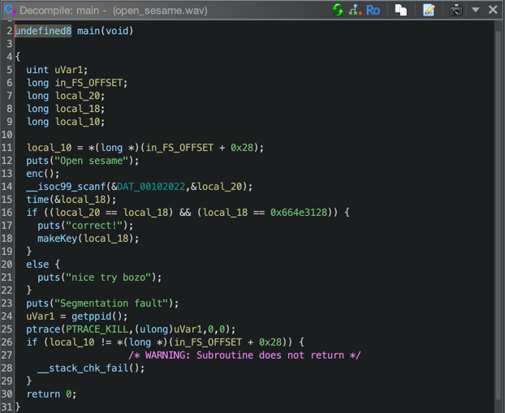

+++
title = "Open Sesame"
description = ""
layout = "writeup"
category = "Reverse Engineering"
points = "500pts"
time_spent = "60 mins"
tools_used = "Linux Command, Ghidra, Unicorn"
date = "2024-11-04"
+++

This challenge named `Open Sesame` was a basic reverse engineering challenge
that involved file formats and basic ELF reversing. 

To start you are given a file named `open_sesame.wav`, however it is not what it appears.
By first running `file` on the binary we can see it is in fact not a WAV file. This is a common
trick to hide and obfuscate files as file extensions really mean nothing unless you are on Windows.
However, even then it is the file header, or the magic bytes, that determines the file type.

```shell
❯ file open_sesame.wav
open_sesame.wav: ELF 64-bit LSB pie executable, x86-64, version 1 (SYSV), 
dynamically linked, interpreter /lib64/ld-linux-x86-64.so.2, 
BuildID[sha1]=cf5bc02b3e5d28fc956a71d81f4cea2680dfc2c8, for GNU/Linux 3.2.0, not stripped
```

So from this, we can see that we are in fact dealing with a 64-bit ELF binary that is not stripped.
This is important, as it means we have symbol information in the binary which will make our 
reverse engineering efforts much easier. So the first thing we will do, is load this up into
Ghidra and make our way to the entry point. 



Loading the file into Ghidra and running the auto analyzer on it, we can find the main function
shown above. Looking at the main function, we can see some important pieces of information. 
First we encrypt some data, then ask for user input. This user input is compared against the
system time and if all that matches, then we make the "key" which is likely our flag. Lastly,
there is some logic at the end of the program to prevent a user from debugging this code. 
A cleaned version of the function can be seen below. 

```c++
int main(void)
{
  uint uVar1;
  long in_FS_OFFSET;
  long user_input;
  long system_time;
  long stack_canary;
  
  stack_canary = *(long *)(in_FS_OFFSET + 0x28);
  puts("Open sesame");
  enc();
  __isoc99_scanf("%lu",&user_input);
  time(&system_time);
  if ((user_input == system_time) && (system_time == 0x664e3128)) {
    puts("correct!");
    makeKey(system_time);
  }
  else {
    puts("nice try bozo");
  }
  puts("Segmentation fault");
                    /* Basic anti-debug logic */
  uVar1 = getppid();
  ptrace(PTRACE_KILL,(ulong)uVar1,0,0);
  if (stack_canary != *(long *)(in_FS_OFFSET + 0x28)) {
                    /* WARNING: Subroutine does not return */
    __stack_chk_fail();
  }
  return 0;
}
```

Looking into the `makeKey` function, we can see that the system time is passed in as a 
parameter to the function. Then some math operations are performed and a decryption function
is called. Here is a somewhat cleaned version of the function:

```c++
void makeKey(long system_time)

{
  long in_FS_OFFSET;
  undefined8 local_b0;
  undefined8 local_a8;
  undefined8 local_a0;
  undefined8 local_98;
  undefined8 local_90;
  long local_88;
  undefined8 local_80;
  undefined8 local_78;
  undefined8 local_70;
  undefined8 local_68;
  long local_60 [9];
  long *encrypted_buffer;
  long stack_canary;
  
  stack_canary = *(long *)(in_FS_OFFSET + 0x28);
  local_60[1] = 0x636170276e6d;
  local_60[2] = 0x61636b;
  local_60[3] = 0x73706172;
  local_60[4] = 0x726f77;
  local_60[5] = 0x5b6e6f745f;
  local_60[6] = 0x7468655f66;
  local_60[7] = 0x6c61675d;
  local_b0 = 0x17555f;
  local_a8 = 0x61636b;
  local_a0 = 0x1c0b84;
  local_98 = 0x726f77;
  local_90 = 0x5b6e6f745f;
  local_88 = system_time % 0x6c61675d;
  local_80 = 0x78b8ca;
  local_78 = 0x7d6eef;
  local_70 = 0x1c0b88;
  local_68 = 0x5b6ee1e3d6;
  local_60[0] = local_88 * 0x5b6e6f745f;
  local_60[8] = system_time;
  encrypted_buffer = (long *)malloc(88);
  *encrypted_buffer = (long)&local_b0;
  encrypted_buffer[1] = (long)&local_a8;
  encrypted_buffer[2] = (long)&local_a0;
  encrypted_buffer[3] = (long)&local_98;
  encrypted_buffer[4] = (long)&local_90;
  encrypted_buffer[5] = (long)&local_88;
  encrypted_buffer[6] = (long)&local_80;
  encrypted_buffer[7] = (long)&local_78;
  encrypted_buffer[8] = (long)&local_70;
  encrypted_buffer[9] = (long)&local_68;
  encrypted_buffer[10] = (long)local_60;
  dec((long)encrypted_buffer);
  if (stack_canary != *(long *)(in_FS_OFFSET + 0x28)) {
                    /* WARNING: Subroutine does not return */
    __stack_chk_fail();
  }
  return;
}
```

From here, we have 3 options. One is to patch the binary such that we can run it without problem.
The second, would be to rewrite the decryption routine in something like python, and the third
option would be to emulate the code. 

While all are valid solutions, I am going to show the emulation route, as many people may not know
it, and it is a good skill to have. Furthermore, I want to show a non-patching related method.
With that being said let's begin. 

In order to emulate the `makeKey` function we are going to use unicorn. Unicor, is a CPU emulator
with simple bindings to Python and other languages. More about unicorn can be found 
[here](https://www.unicorn-engine.org/). So using unicorn we are going to emulate the function
right up to the `dec` function call and dump the contents of the encrypted buffer. We do this
to keep the logic simple, also to prevent us from having to deal with jumps between functions
in the stack. 

```python
from unicorn import *
from unicorn.x86_const import *

# Machine code
mc = bytes.fromhex('55 48 89 e5 48 81 ec c0 00 00 00 48 89 bd 48 ff ff ff 64 48 8b 04 25 28 00 00 00 48 89 45 f8 31 c0 \
48 b8 6d 6e 27 70 61 63 00 00 48 89 45 b0 48 c7 45 b8 6b 63 61 00 48 c7 45 c0 72 61 70 73 48 c7 45 c8 77 6f 72 00 48 \
b8 5f 74 6f 6e 5b 00 00 00 48 89 45 d0 48 b8 66 5f 65 68 74 00 00 00 48 89 45 d8 48 c7 45 e0 5d 67 61 6c 48 8b 85 48 \
ff ff ff 48 89 45 e8 48 8b 45 b0 48 99 48 f7 7d b8 48 89 d0 48 89 85 58 ff ff ff 48 8b 45 b8 48 99 48 f7 7d c0 48 89 \
d0 48 89 85 60 ff ff ff 48 8b 45 c0 48 99 48 f7 7d c8 48 89 d0 48 89 85 68 ff ff ff 48 8b 45 c8 48 99 48 f7 7d d0 48 \
89 d0 48 89 85 70 ff ff ff 48 8b 45 d0 48 99 48 f7 7d d8 48 89 d0 48 89 85 78 ff ff ff 48 8b 45 e8 48 99 48 f7 7d e0 \
48 89 d0 48 89 45 80 48 8b 95 58 ff ff ff 48 8b 85 60 ff ff ff 48 01 d0 48 89 45 88 48 8b 95 60 ff ff ff 48 8b 85 68 \
ff ff ff 48 01 d0 48 89 45 90 48 8b 85 68 ff ff ff 48 83 c0 04 48 89 45 98 48 8b 95 70 ff ff ff 48 8b 85 78 ff ff ff \
48 01 d0 48 89 45 a0 48 8b 95 78 ff ff ff 48 8b 45 80 48 0f af c2 48 89 45 a8 bf 58 00 00 00 e8 6d fd ff ff 48 89 45 \
f0 48 8b 45 f0 48 8d 95 58 ff ff ff 48 89 10 48 8b 45 f0 48 8d 50 08 48 8d 85 60 ff ff ff 48 89 02 48 8b 45 f0 48 8d \
50 10 48 8d 85 68 ff ff ff 48 89 02 48 8b 45 f0 48 8d 50 18 48 8d 85 70 ff ff ff 48 89 02 48 8b 45 f0 48 8d 50 20 48 \
8d 85 78 ff ff ff 48 89 02 48 8b 45 f0 48 8d 50 28 48 8d 45 80 48 89 02 48 8b 45 f0 48 8d 50 30 48 8d 45 88 48 89 02 \
48 8b 45 f0 48 8d 50 38 48 8d 45 90 48 89 02 48 8b 45 f0 48 8d 50 40 48 8d 45 98 48 89 02 48 8b 45 f0 48 8d 50 48 48 \
8d 45 a0 48 89 02 48 8b 45 f0 48 8d 50 50 48 8d 45 a8 48 89 02 48 8b 45 f0 48 89 c7')

emu = unicorn.Uc(UC_ARCH_X86, UC_MODE_64)

stack_addr = 0x0002000
stack_size = 0x0001000
emu.mem_map(stack_addr, stack_size)

reg_esp = stack_addr + stack_size // 2
emu.reg_write(UC_X86_REG_ESP,reg_esp)

code_addr = 0x0005000
code_size = 0x0001000
emu.mem_map(code_addr, code_size)

emu.mem_write(code_addr, mc)

# FS segment base address (arbitrarily chosen in this example)
fs_base = 0x100000
fs_size = 0x1000  # Size large enough to cover offset 0x28
emu.mem_map(fs_base, fs_size)

# Set FS base (Unicorn API for setting FS base may vary based on the architecture)
emu.reg_write(UC_X86_REG_FS_BASE, fs_base)

# Load the passed parameter
emu.reg_write(UC_X86_REG_RDI, 0x664e3128) # system_time parameter

# Write a value to the FS:[0x28] address
fs_offset = 0x28
value_to_write = 0x123456789ABCDEF0  # Example value
emu.mem_write(fs_base + fs_offset, value_to_write.to_bytes(8, byteorder="little"))

# Track last instruction
last_instr_address = None
last_instr_size = None

# Define addresses and sizes for the heap and stack
heap_base = 0x200000
heap_size = 0x10000  # 64 KB
emu.mem_map(heap_base, heap_size)
next_free_address = heap_base

# Define the callback function to capture instructions
def track_instructions(mu, address, size, user_data):
    global last_instr_address, last_instr_size
    last_instr_address = address
    last_instr_size = size

# Track allocations
def mock_malloc(size):
    global next_free_address
    if next_free_address + size > heap_base + heap_size:
        raise MemoryError("Out of emulated heap memory.")
    allocated_address = next_free_address
    next_free_address += size
    return allocated_address

# Hook to intercept and handle malloc calls
def hook_code(emu, address, size, user_data):
    # Check if the instruction is a call to `malloc`
    # You may need to set the address of `malloc` here.
    malloc_addr = 0x5151  # Example address where malloc is located
    if address == malloc_addr:
        # Intercepting the malloc call
        size_to_allocate = emu.reg_read(UC_X86_REG_RDI)  # Read size from RDI
        malloc_return = mock_malloc(size_to_allocate)  # Call our mock malloc

        # Set RAX (return register) to our allocated address
        emu.reg_write(UC_X86_REG_RAX, malloc_return)

        # Skip the actual malloc call in emulation
        emu.reg_write(UC_X86_REG_RIP, emu.reg_read(UC_X86_REG_RIP) + size)

# Add the hook for all instructions
#emu.hook_add(UC_HOOK_CODE, track_instructions)
emu.hook_add(UC_HOOK_CODE, hook_code)

# Emulate and catch errors
try:
    start_addr = code_addr
    end_addr = code_addr + len(mc)
    emu.emu_start(start_addr, end_addr)

    rax_pointer = emu.reg_read(UC_X86_REG_RAX)
    for i in range(11):
        # Read the address at encrypted_buffer[i]
        address = emu.mem_read(rax_pointer + i * 8, 8)  # 4 bytes for a long address
        address = int.from_bytes(address, 'little')  # Convert bytes to integer (address)

        # Now read the value at this address
        value = emu.mem_read(address, 8)  # Assuming the value is also a long (4 bytes)
        value = int.from_bytes(value, 'little')  # Convert bytes to integer (value)

        print(f'Address: {hex(address)}, Value: {value}')
except UcError as e:
    print(f"Emulation error: {e}")
    if last_instr_address is not None:
        # Get the opcode that caused the issue
        faulty_instr = emu.mem_read(last_instr_address, last_instr_size)
        print(f"Last instruction address: 0x{last_instr_address:X}")
        print(f"Faulty instruction opcode: {faulty_instr.hex()}")
```

Looking at the code above, there are 2 major things you need to watch out for that makes this code
work without issue. The first is the setting up of the stack canary and the second is the hook
around malloc. The need for the stack canary setup is that for clarity I choose to emulate those
instructions, however, unicorn doesn't automatically set up the FS and GS registers, so we have
to do it ourselves. Secondly, unicorn is a CPU emulator and therefore doesn't emulator C standard
library functions, so we need to implement a basic malloc ourselves. Once that is done we can easily
emulate the code and dump the buffer afterward. 

After this is done, we need to grab the encrypted data that is being read by the `dec` function.
A quick look at the code shows that it is built very close to a stack string, so using one
of the many stack string script out there we can dump the encrypted bytes.

```shell
(emu_env) root@d13a9cb9905a:/open_sesame# python make_key_emu.py
Address: 0x2750, Value: 1529183
Address: 0x2758, Value: 6382443
Address: 0x2760, Value: 1837956
Address: 0x2768, Value: 7499639
Address: 0x2770, Value: 392694821983
Address: 0x2778, Value: 1716400424
Address: 0x2780, Value: 7911626
Address: 0x2788, Value: 8220399
Address: 0x2790, Value: 1837960
Address: 0x2798, Value: 392702321622
Address: 0x27a0, Value: 9938772300681862616
```

```c++
void enc(void)

{
  FILE *enc_file_buffer;
  long in_FS_OFFSET;
  char encrypted_flag [72];
  long stack_canary;
  
  stack_canary = *(long *)(in_FS_OFFSET + 0x28);
  encrypted_flag[0] = -0x51;
  encrypted_flag[1] = -0x53;
  encrypted_flag[2] = -0x5c;
  encrypted_flag[3] = -99;
  encrypted_flag[4] = -0x60;
  encrypted_flag[5] = -0x62;
  encrypted_flag[6] = -0x51;
  encrypted_flag[7] = -0x5f;
  encrypted_flag[8] = -0x4a;
  encrypted_flag[9] = -100;
  encrypted_flag[10] = -0x4e;
  encrypted_flag[0xb] = -0x60;
  encrypted_flag[0xc] = 'p';
  encrypted_flag[0xd] = 'k';
  encrypted_flag[0xe] = -0x58;
  encrypted_flag[0xf] = -0x60;
  encrypted_flag[0x10] = -0x66;
  encrypted_flag[0x11] = -0x4e;
  encrypted_flag[0x12] = 'k';
  encrypted_flag[0x13] = -0x53;
  encrypted_flag[0x14] = -0x5a;
  encrypted_flag[0x15] = -0x66;
  encrypted_flag[0x16] = -0x58;
  encrypted_flag[0x17] = 'k';
  encrypted_flag[0x18] = -0x53;
  encrypted_flag[0x19] = -0x60;
  encrypted_flag[0x1a] = -0x66;
  encrypted_flag[0x1b] = -0x5f;
  encrypted_flag[0x1c] = -0x50;
  encrypted_flag[0x1d] = -0x57;
  encrypted_flag[0x1e] = -0x66;
  encrypted_flag[0x1f] = -0x62;
  encrypted_flag[0x20] = -0x5d;
  encrypted_flag[0x21] = -100;
  encrypted_flag[0x22] = 'l';
  encrypted_flag[0x23] = 'l';
  encrypted_flag[0x24] = -0x60;
  encrypted_flag[0x25] = -0x57;
  encrypted_flag[0x26] = -0x5e;
  encrypted_flag[0x27] = -0x60;
  encrypted_flag[0x28] = 'p';
  encrypted_flag[0x29] = -0x66;
  encrypted_flag[0x2a] = -100;
  encrypted_flag[0x2b] = -0x4e;
  encrypted_flag[0x2c] = -100;
  encrypted_flag[0x2d] = 'l';
  encrypted_flag[0x2e] = -0x51;
  encrypted_flag[0x2f] = -0x66;
  encrypted_flag[0x30] = -0x4c;
  encrypted_flag[0x31] = 'k';
  encrypted_flag[0x32] = -0x50;
  encrypted_flag[0x33] = -0x66;
  encrypted_flag[0x34] = -0x4e;
  encrypted_flag[0x35] = 'l';
  encrypted_flag[0x36] = -0x51;
  encrypted_flag[0x37] = -0x5d;
  encrypted_flag[0x38] = -0x5c;
  encrypted_flag[0x39] = -0x57;
  encrypted_flag[0x3a] = -0x48;
  enc_file_buffer = fopen("enc.dat","w");
  fputs(encrypted_flag,enc_file_buffer);
  fclose(enc_file_buffer);
  if (stack_canary != *(long *)(in_FS_OFFSET + 0x28)) {
                    /* WARNING: Subroutine does not return */
    __stack_chk_fail();
  }
  return;
}
```


So we can use the follow script below with similar techniques as before to dump the encrypted 
data.

```python
from unicorn import *
from unicorn.x86_const import *

# Machine code
mc = bytes.fromhex('55 48 89 e5 48 83 ec 60 64 48 8b 04 25 28 00 00 00 48 89 45 f8 31 c0 48 b8 af ad a4 9d a0 9e af \
a1 48 ba b6 9c b2 a0 70 6b a8 a0 48 89 45 b0 48 89 55 b8 48 b8 9a b2 6b ad a6 9a a8 6b 48 ba ad a0 9a a1 b0 a9 9a 9e \
48 89 45 c0 48 89 55 c8 48 b8 a3 9c 6c 6c a0 a9 a2 a0 48 ba 70 9a 9c b2 9c 6c af 9a 48 89 45 d0 48 89 55 d8 48 b8 b2 \
9c 6c af 9a b4 6b b0 48 ba 9a b2 6c af a3 a4 a9 b8 48 89 45 db 48 89 55 e3 48 c7 45 a0 3b 00 00 00')

emu = unicorn.Uc(UC_ARCH_X86, UC_MODE_64)

stack_addr = 0x0002000
stack_size = 0x0001000
emu.mem_map(stack_addr, stack_size)

reg_esp = stack_addr + stack_size // 2
emu.reg_write(UC_X86_REG_ESP,reg_esp)

code_addr = 0x0005000
code_size = 0x0001000
emu.mem_map(code_addr, code_size)

emu.mem_write(code_addr, mc)

# FS segment base address (arbitrarily chosen in this example)
fs_base = 0x100000
fs_size = 0x1000  # Size large enough to cover offset 0x28
emu.mem_map(fs_base, fs_size)

# Set FS base (Unicorn API for setting FS base may vary based on the architecture)
emu.reg_write(UC_X86_REG_FS_BASE, fs_base)

# Write a value to the FS:[0x28] address
fs_offset = 0x28
value_to_write = 0x123456789ABCDEF0  # Example value
emu.mem_write(fs_base + fs_offset, value_to_write.to_bytes(8, byteorder="little"))

# Track last instruction
last_instr_address = None
last_instr_size = None

# Define the callback function to capture instructions
def track_instructions(mu, address, size, user_data):
    global last_instr_address, last_instr_size
    last_instr_address = address
    last_instr_size = size

# Add the hook for all instructions
#emu.hook_add(UC_HOOK_CODE, track_instructions)

# Emulate and catch errors
try:
    start_addr = code_addr
    end_addr = code_addr + len(mc)
    emu.emu_start(start_addr, end_addr)

    reg_rpb = emu.reg_read(UC_X86_REG_RSP)
    stack_content = emu.mem_read(reg_rpb + 16, 60)

    print(stack_content.hex())

except UcError as e:
    print(f"Emulation error: {e}")
    if last_instr_address is not None:
        # Get the opcode that caused the issue
        faulty_instr = emu.mem_read(last_instr_address, last_instr_size)
        print(f"Last instruction address: 0x{last_instr_address:X}")
        print(f"Faulty instruction opcode: {faulty_instr.hex()}")
```

Running the script gets us the following encrypted data:
```shell
(emu_env) root@d13a9cb9905a:/open_sesame# python encrypt_emu.py
afada49da09eafa1b69cb2a0706ba8a09ab26bada69aa86bada09aa1b0a99a9ea39c6c6ca0a9a2a0709a9cb29c6caf9ab46bb09ab26cafa3a4a9b800
```

Once, we have the encrypted data and the key all that is left is to do the decryption.
For this I chose to translate the code to python. The following code can be seen below:

Decompiled code:
```c++
void dec(long param_1)

{
  FILE *__stream;
  size_t sVar1;
  long in_FS_OFFSET;
  int counter;
  int local_74;
  char flag_buffer [72];
  long local_20;
  
  local_20 = *(long *)(in_FS_OFFSET + 0x28);
  __stream = fopen("enc.dat","r");
  fgets(flag_buffer,60,__stream);
  for (counter = 0; counter < 11; counter = counter + 1) {
    local_74 = 0;
    while( true ) {
      sVar1 = strlen(flag_buffer);
      if (sVar1 <= (ulong)(long)local_74) break;
      flag_buffer[local_74] =
           flag_buffer[local_74] - (char)**(undefined8 **)(param_1 + (long)counter * 8);
      local_74 = local_74 + 1;
    }
  }
  sVar1 = strlen(flag_buffer);
  printf("%.*s\n",sVar1 & 0xffffffff,flag_buffer);
  if (local_20 != *(long *)(in_FS_OFFSET + 0x28)) {
                    /* WARNING: Subroutine does not return */
    __stack_chk_fail();
  }
  return;
}
```

Translated code:
```python
encrypted_data = bytes.fromhex(
    'afada49da09eafa1b69cb2a0706ba8a09ab26bada69aa86bada09aa1\
    b0a99a9ea39c6c6ca0a9a2a0709a9cb29c6caf9ab46bb09ab26cafa3a4a9b800'
)
key_data = [
    1529183,
    6382443,
    1837956,
    7499639,
    392694821983,
    1716400424,
    7911626,8220399,
    1837960,
    392702321622,
    9938772300681862616
]

flag_buffer = []

for i in range(len(encrypted_data)-1):
    flag_buffer.append(encrypted_data[i])
    for j in range(11):
        flag_buffer[i] -= key_data[j]
        flag_buffer[i] = flag_buffer[i] % 256

data = ''
for i in flag_buffer:
    data += chr(i)

print(data)
```

Running the decryption gets us the following flag:
`tribectf{awe50me_w0rk_m0re_fun_cha11enge5_awa1t_y0u_w1thin}`

And just like that you learned a bit about emulation as well as reverse engineering.
It is worth noting that emulation is not the only way to solve this challenge, however, 
it is one of the ways. It might be easier to patch this binary, however, I wanted to
show that there is not always just one way to do something.